<br />
<div>
<h3 style="text-align: center">PRAGMA POWER-UP</h3>
  <p style="text-align: center">
    In this challenge you are going to design the backend of a system that centralizes the services and orders of a restaurant chain that has different branches in the city.
  </p>
</div>

### Built With

* 
* 
* 
* 
* 


<!-- GETTING STARTED -->
## Getting Started

To get a local copy up and running follow these steps.

### Prerequisites

* JDK 17 [https://jdk.java.net/java-se-ri/17](https://jdk.java.net/java-se-ri/17)
* Gradle [https://gradle.org/install/](https://gradle.org/install/)

### Recommended Tools
* IntelliJ Community [https://www.jetbrains.com/idea/download/](https://www.jetbrains.com/idea/download/)
* Postman [https://www.postman.com/downloads/](https://www.postman.com/downloads/)

### Installation

###### Recommendation: Watch the following video ######

<br>LINKS:
<br> https://youtu.be/xIQZolmvbtM - Project explained
<br> https://youtu.be/PLQHsIf7g5g - Additional project settings

1. Clone the repository
   <br>
   <b>Steps:</b>
   <br>
   1. Press the green ``code`` button and press the copy button to copy the link
      <br><br>
      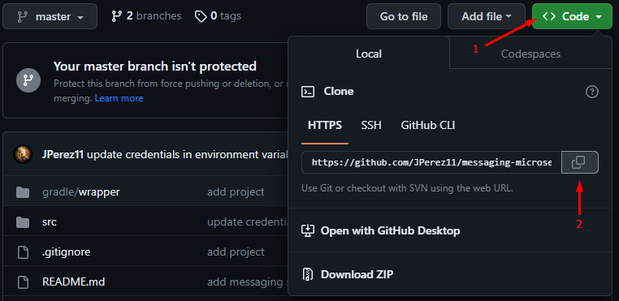
      <br><br>
   2. Open a terminal like Git Bash and type the command ``git clone`` + the repository link copied earlier
   ```shell
   git clone https://github.com/JPerez11/messaging-microservice
   ```
   3. Change directory
   ```shell
   cd messaging-microservice
   ```

<!-- USAGE -->
## Usage

1. Before you run the project, perform the following steps to create the environment variables in your local application
   <br>
   <b>Steps:</b>
   <br>
   1. Register on the official Twilio website for the free trial at the following link: https://www.twilio.com/
      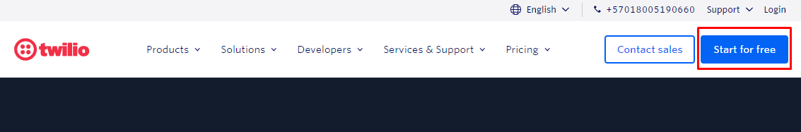
      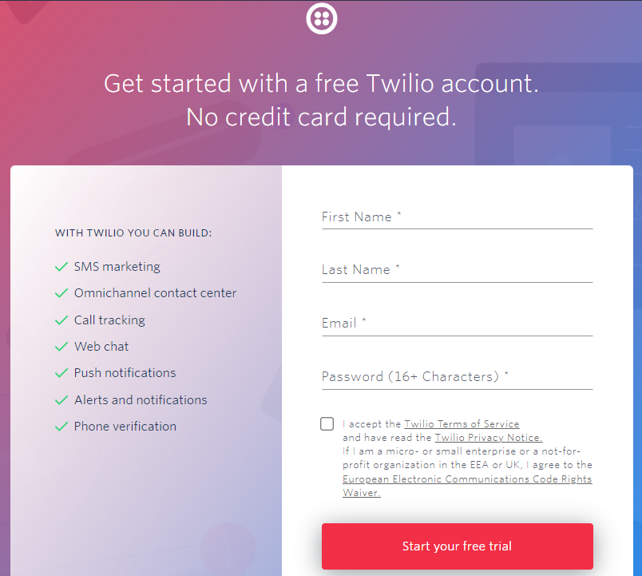
   2. Twilio will ask us to register a phone number to which it is the only one that can be sent notifications due to the free trial
   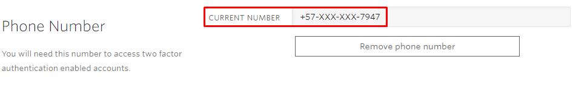
   3. Then we checked the Twilio console in which we found the access credentials to consume the API
   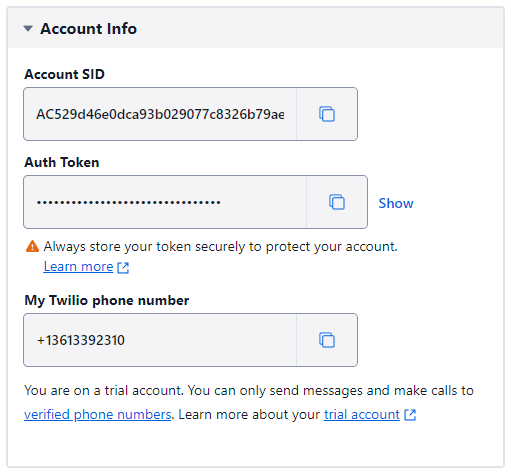
   4. Then inside the IntelliJ IDEA, we go to the project execution configuration and add the environment variables
      * Click Run
      <br>
      
      * Click edit configurations
      <br>
      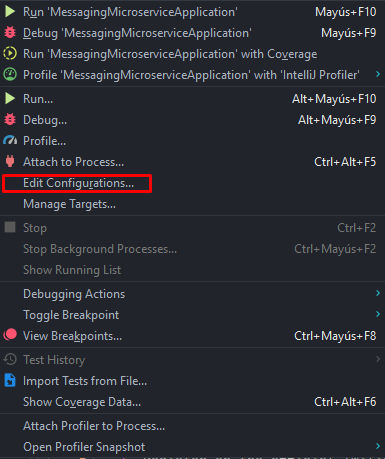
      * When entering the configuration it is possible that the configurations already ready do not appear, as can be seen in the following image:
      * <br>
      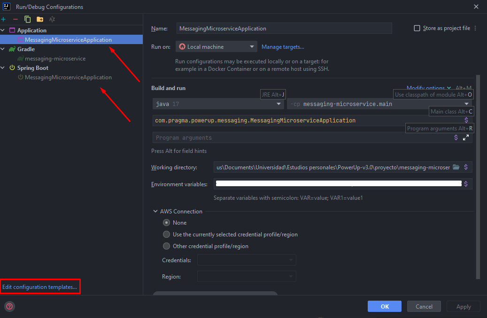
      * Therefore, by clicking on the button "Edit configuration templates..." at the bottom, we will display a modal in which we must look for the "Application" section
      <br>
      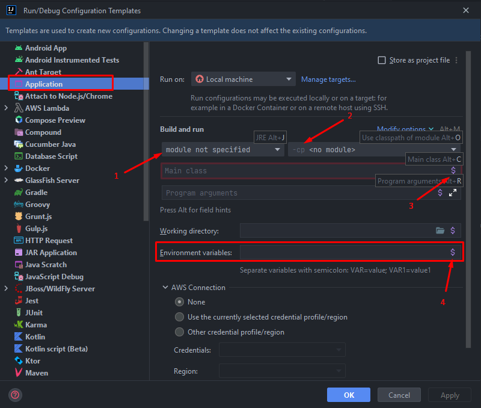
      <br>When entering the Application section, the following should be added:
      <br>1.The version of Java under which the application runs;
      <br>2.The path of the main class;
      <br>3.The main class to execute;
      <br>4.Clicking on the $ sign in Environment Variables will open the following tab:
      <br>
      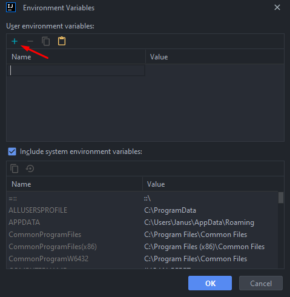
      <br>Here we are going to add as environment variables the credentials provided by Twilio with the following names:
      <br>
      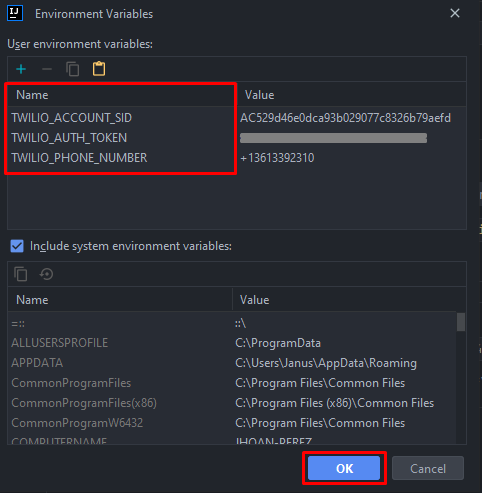
      * In the end, the configuration should resemble the following:
      <br>
      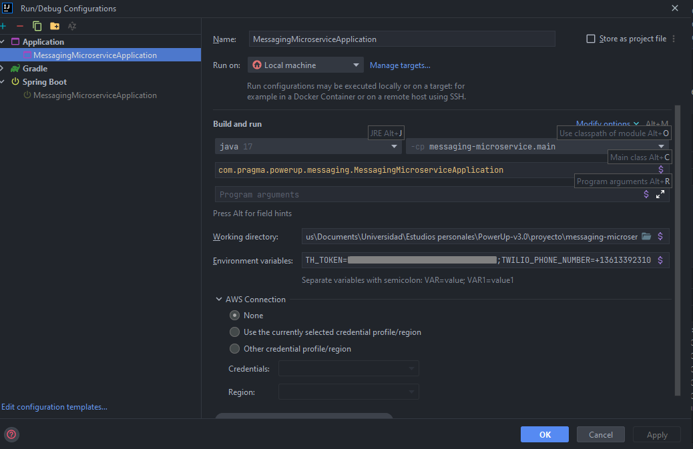
      * By making the above configurations, it will be possible to run the application

   5. Right-click the class MessagingMicroserviceApplication and choose Run
   6. Open [http://localhost:8092/swagger-ui/index.html](http://localhost:8092/swagger-ui/index.html) in your web browser
<!-- ROADMAP -->
## Tests

- Right-click the test folder and choose Run tests with coverage
